# Deep Reinforcement Learning - HW3

This repository contains the implementations for Homework 3: Deep Q-Networks (DQN) and its Variants. The project is divided into four main parts, ranging from a basic DQN to an advanced Rainbow DQN, tested on different difficulty modes of a GridWorld environment.

## Folder Structure
- `env/`: Contains the GridWorld environment files (`GridBoard.py` and `Gridworld.py`).
- `result/`: Contains the generated loss/reward curve plots and test animation GIFs.
- `hw3_1.py` ~ `hw3_4.py`: The Python scripts for each part of the homework.
- `understanding_report.md`: Detailed report explaining the RL concepts and architectural choices used in this project.
- `chat2.pdf`: The conversation history from the AI assistant session.

---

## Part 1: Basic DQN for Static Mode (`hw3_1.py`)
In this part, we implement a basic Deep Q-Network (DQN) to solve the GridWorld environment in `static` mode.
- **Features**: Uses an Experience Replay Buffer and an Epsilon-Greedy strategy.
- **Results**: Achieves a 100% win rate very quickly as the environment is deterministic.
- **Animation**:
  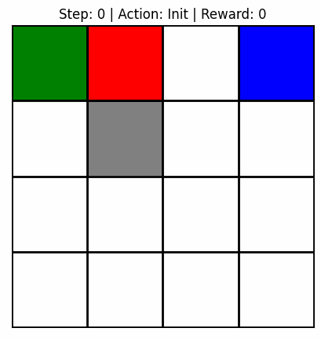
- **Curves**:
  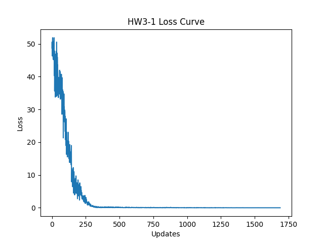 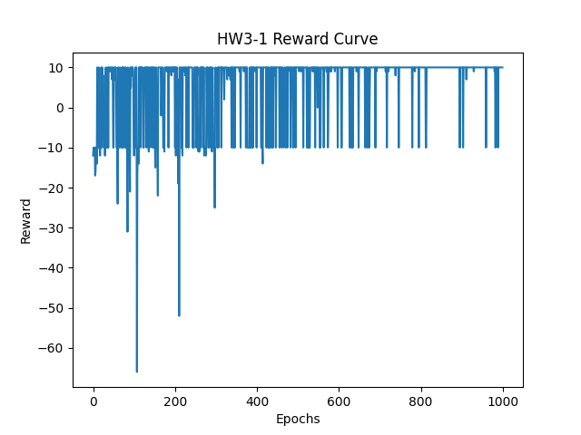

---

## Part 2: Enhanced DQN Variants for Player Mode (`hw3_2.py`)
This part evaluates the agent in `player` mode, where the player's starting position is randomized. We compare three architectures:
1. **Basic DQN**: Standard target evaluation.
2. **Double DQN**: Decouples action selection and target Q-value evaluation to mitigate overestimation.
3. **Dueling DQN**: Separates the Q-network into a State-Value stream and an Advantage stream.
- **Results**: All three models successfully learn the environment (near 100% win rate), but Dueling DQN generally shows more stable learning curves.
- **Animation**:
  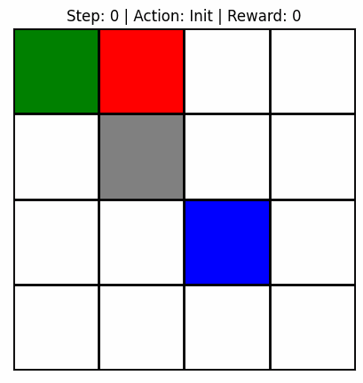
- **Curves**:
  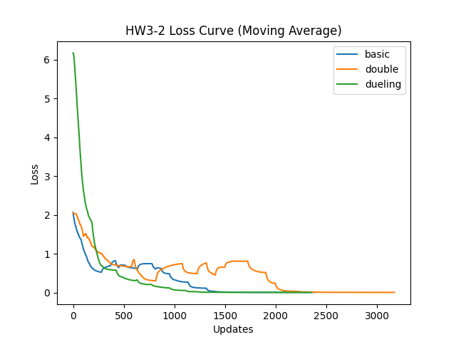 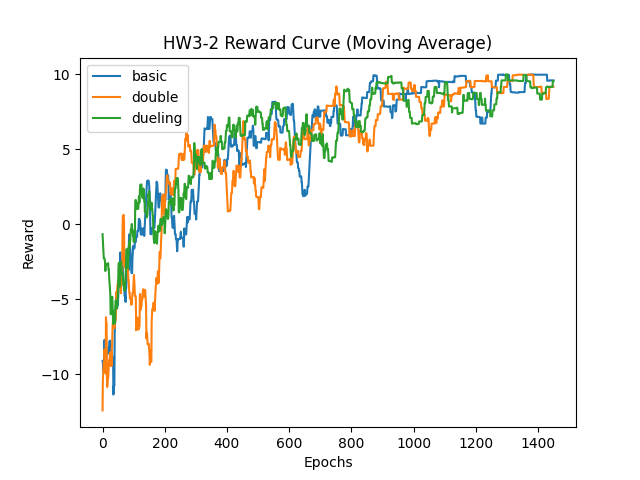

---

## Part 3: PyTorch Lightning + Training Tips for Random Mode (`hw3_3.py`)
The environment is set to `random` mode (all objects randomized), which is extremely challenging. We rewrote the agent using **PyTorch Lightning** and incorporated essential training tips:
1. **Learning Rate Scheduler** (`ExponentialLR`)
2. **Gradient Clipping** (`clip_gradients(val=1.0)`)
3. **Target Network Updates** (Hard sync every 50 epochs)
- **Results**: Standard DQN struggles significantly in this highly stochastic environment, yielding a very low win rate (approx 10-20%).
- **Animation**:
  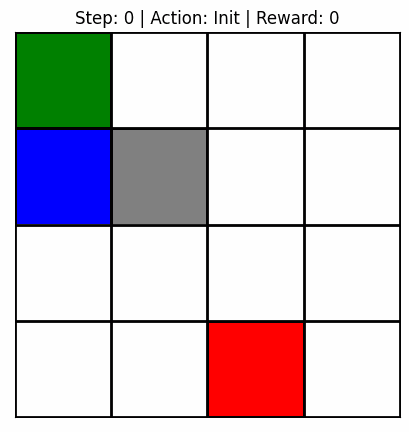
- **Curves**:
  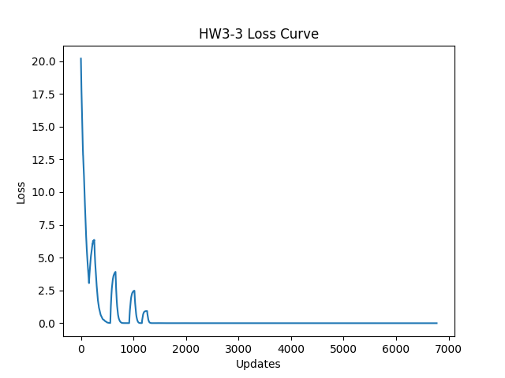 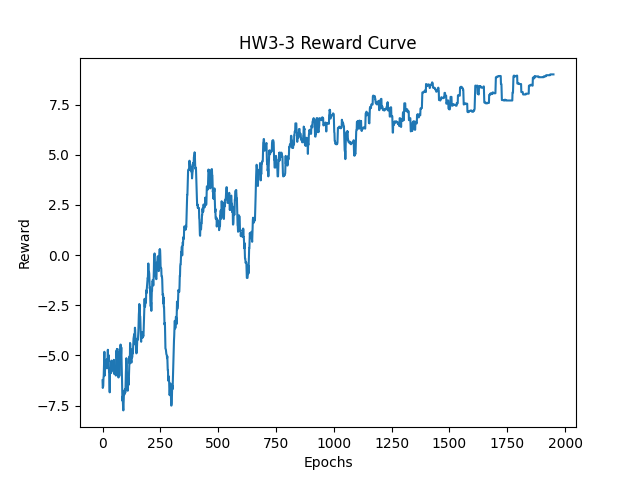

---

## Part 4: Simplified Rainbow DQN for Random Mode (`hw3_4.py`)
To overcome the difficulties in the `random` mode, we implemented a simplified **Rainbow DQN** combining four advanced techniques:
1. **Double DQN** (Prevents overestimation)
2. **Dueling Architecture** (Better state evaluation)
3. **Multi-step (N-step) Returns** (Balances bias and variance, speeds up propagation)
4. **Prioritized Experience Replay (PER)** (Focuses training on "surprising" transitions)
- **Results**: The combination of these techniques vastly improves the performance, jumping from ~15% to a **~60-70% win rate** within just 2000 epochs.
- **Animation**:
  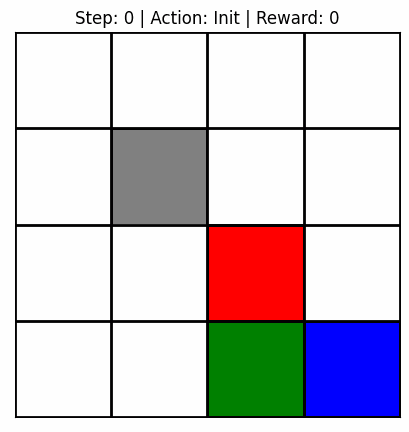
- **Curves**:
  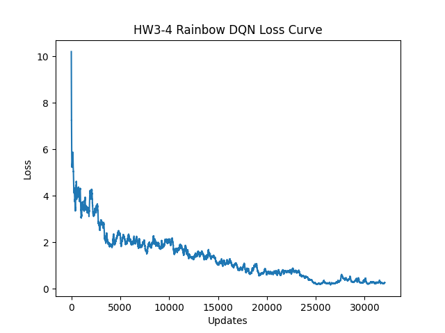 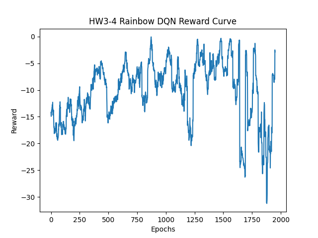
